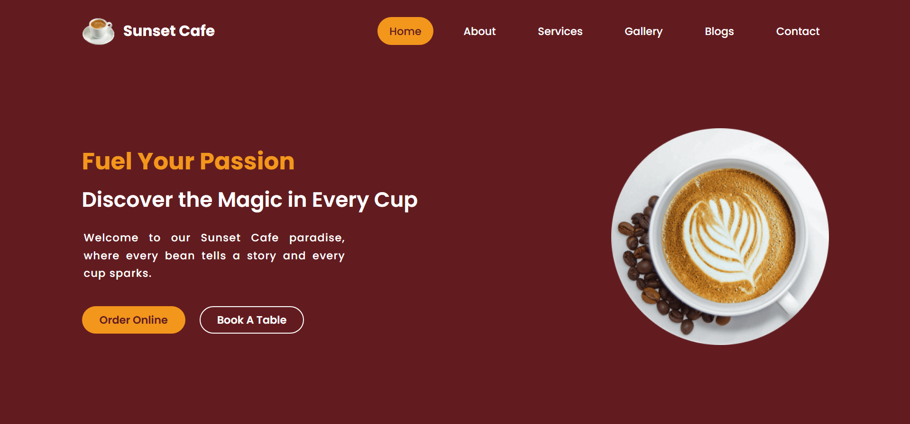
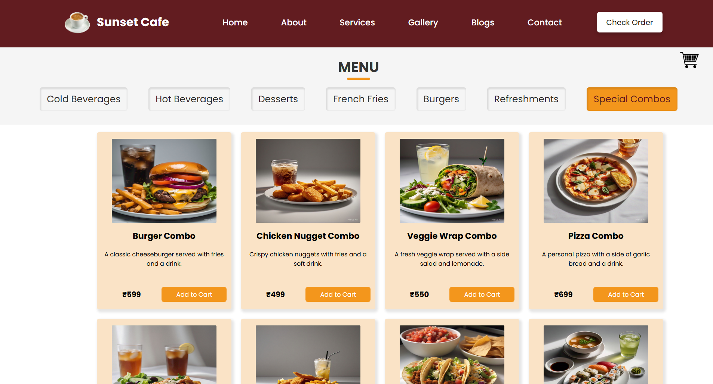
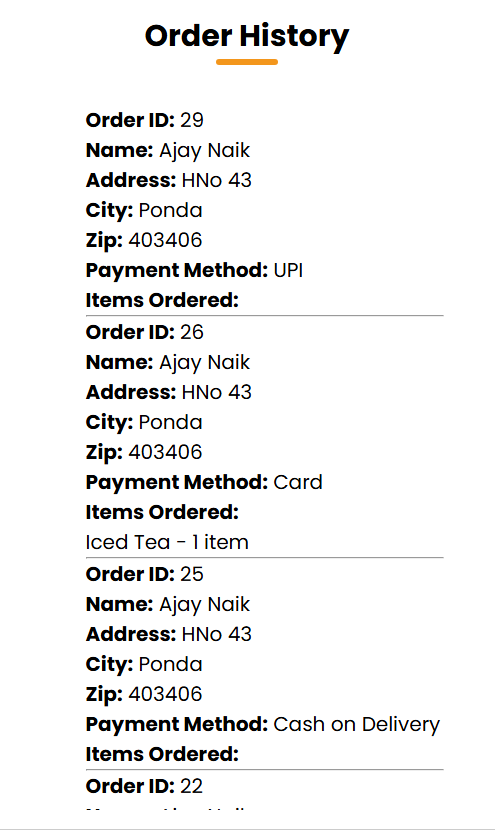
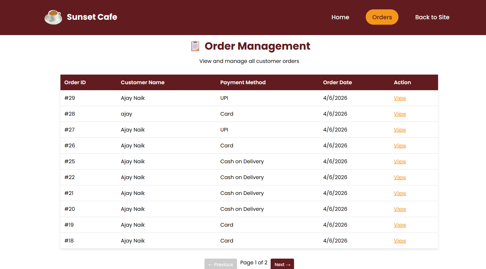

# ☕ Sunset Cafe

A full-stack cafe ordering and management system built using HTML, CSS, JavaScript, PHP, and MySQL.

## Features

### Customer Features

- Browse menu by category
- Add items to cart
- Update item quantities
- Online checkout system
- Cash on Delivery (COD)
- UPI Payments
- Credit/Debit Card Payments
- Order History powered by MySQL
- Table Booking System
- Contact Form

### Admin Features

- Order Management Dashboard
- View Complete Order Details
- Customer Information Tracking
- Payment Method Tracking
- Ordered Items & Quantities
- Paginated Order Listing

## Screenshots

### Home Page



### Menu Page



### Order History



### Admin Dashboard



## Tech Stack

### Frontend

- HTML5
- CSS3
- JavaScript

### Backend

- PHP

### Database

- MySQL

### Development Environment

- XAMPP

## Database Structure

### orders

Stores:

- Customer Details
- Address Information
- Payment Method
- UPI Details
- Last 4 Card Digits
- Card Expiry Date
- Order Timestamp

### order_items

Stores:

- Ordered Items
- Item Price
- Item Quantity
- Linked Order ID

### table_booking

Stores table reservation information.

### contact

Stores contact form submissions.

## Security

- PDO Prepared Statements
- SQL Injection Protection
- CVC Not Stored
- Only Last 4 Card Digits Stored
- Database Credentials Excluded from Git

## Installation

### 1. Clone Repository

```bash
https://github.com/Ajay-Naik/Coffee_website.git
```

### 2. Import Database

Open phpMyAdmin:

1. Create database:

```sql
coffee_shop
```

2. Import:

```text
database_schema.sql
```

### 3. Configure Database

Copy:

```text
connect.example.php
```

to:

```text
connect.php
```

Update credentials:

```php
$host = "localhost";
$dbname = "coffee_shop";
$username = "root";
$password = "";
```

### 4. Run Application

Place project in:

```text
xampp/htdocs/
```

Start:

- Apache
- MySQL

Open:

```text
http://localhost/coffee_website/codes/index.html
```

## Project Highlights

- Responsive Design
- Dynamic Shopping Cart
- MySQL Order Storage
- Order History System
- Admin Order Details Modal
- Card / UPI / COD Support
- Table Reservation System
- Contact Form Integration

## Future Improvements

- User Authentication
- Email Notifications
- Online Payment Gateway Integration
- Sales Analytics Dashboard
- Inventory Management

## Author

**Ajay Naik**
